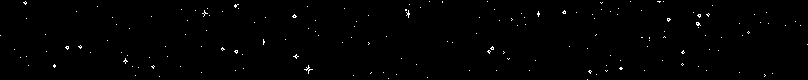

# Starsheet

Generate pleasing images of a sky that doesn't exist.

A library and a cli binary.

**The Future**: A GUI, eventually, for fun!

## Binary
Install with `cargo install starsheet` and then run with `starsheet`.

Currently, only PNGs will be output. You can change the **--width** with the
**-w** flag, and the **--height** with **-h**. The amount of stars that are
generated is a sort of *density*. The density, or number of **--stars** per
100 square pixels, can be changed with the **-s** option. I find that a good
density is around 20.

[Here](docs/example.png) is an example of a 1000x1000 image with a density
of 20. The command looked like this:  
`starsheet -w 1000 -h 1000 -s 20 example`

There is currently no way to change the percentages of the stars brightness,
but **this is coming**!

## Library
The documentation is currently not too great! Good thing there's only one
struct with like 5 methods. Documentation will be improved. Until then, you
can have a look at the binary source [here](src/main.rs), or the example
below.

```rust
use starsheet::Space;

// Generates an image with the same parameters as the example image
fn main() {
	// Create a new Space struct with a width and height of 1000 pixels
	let mut space = Space::new(1000, 1000);
	// Fill space randomly with stars at a density of 20 stars per 100 pixels^2
    space.fill_randomly(20);
	
	// Get the width and height from space
    let width = space.width();
	let height = space.height();
	
	// Consume space and get the underlying pixel data. Each u8 is a black
	// level, so the image is greyscale.
	let data = space.to_data();
	
	// ... From here you can manipulate the image further by operating on the
	// pixel data or feed it to some kind of image encoder to write as a file.
}
```